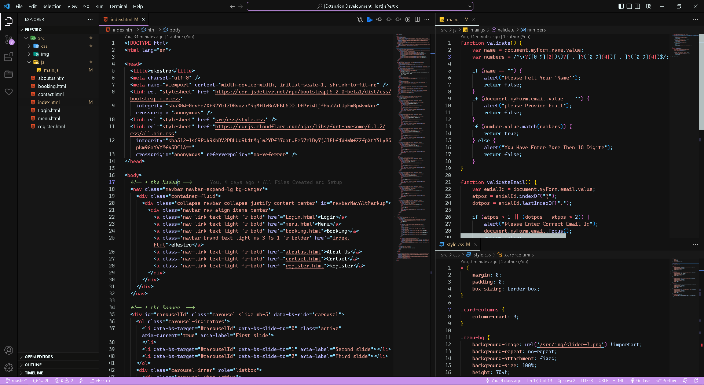

# MacDark for [Visual Studio Code](http://code.visualstudio.com)

> Click Here To See The Theme Or Download [MacDark - Theme](https://marketplace.visualstudio.com/items?itemName=MaulikCodes.macdark).

## Thank You So Much ❤

Thanks for checking out my VS Code theme. I hope you will love it.

## Installation 🖥

1. Open the extensions sidebar on Visual Studio Code
1. Search for MacDark - Theme
1. Click Install
1. Click Reload to reload your editor
1. Select the Manage Cog (bottom left) > Color Theme ＞ MacDark - Theme
1. 🌟🌟🌟🌟🌟 Rate five-stars 😃

## Issues & Suggestions ⚠

For any issues or suggestions, please use [GitHub issues](https://github.com/themaulik/MacDark-Theme/issues).

## Contributing 👷‍♂️

If you'd like to contribute to this theme, please read the [contributing guidelines](https://docs.github.com/en/communities/setting-up-your-project-for-healthy-contributions/setting-guidelines-for-repository-contributors).

